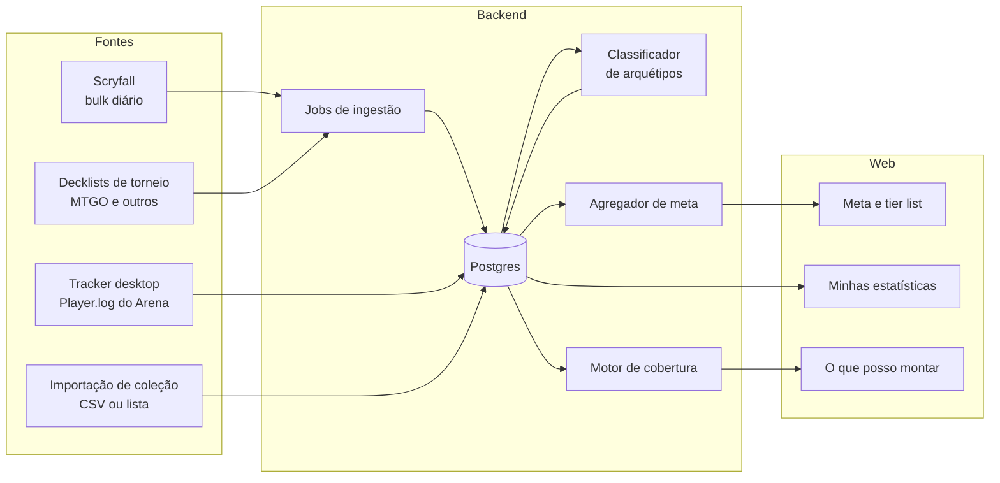

# Arquitetura — meta, partidas e coleção para Magic: The Gathering

O sistema junta três coisas que hoje vivem em ferramentas separadas:

1. **Meta** — quais decks estão jogando e ganhando, por formato (papel, MTGO e Arena).
2. **Minhas partidas** — histórico e estatísticas pessoais do Arena, capturados por um app desktop.
3. **O que posso montar** — cruza a coleção da pessoa com os decks do meta e mostra o que ela está mais perto de completar e quanto custa terminar.

As três se apoiam na mesma base: um banco de **cartas** e um banco de **decks**. O motor de cobertura (item 3) e o site com o meta do MTGO (item 1, parte de torneios) já existem neste repositório.

## Visão geral



## Stack

TypeScript em tudo. O motivo principal é o tracker: ele precisa ser um app desktop (Electron, que roda Node), e com uma linguagem só o mesmo código de parser, de cartas e de cobertura roda no desktop, no servidor e no navegador.

| Peça | Escolha | Por quê |
|---|---|---|
| Núcleo compartilhado | pacote `core` (este repositório) | Parsers, motor de cobertura, classificador. Sem dependências. |
| Web | Next.js | Páginas de meta indexáveis pelo Google (SEO é o canal de aquisição desse tipo de site) e API no mesmo projeto no início. |
| Banco | Postgres (Supabase ou Neon); hoje PGlite local | Relacional, bom para agregações de meta. Enquanto não há conta em serviço de hospedagem, roda o PGlite (Postgres embutido, em arquivo), com o mesmo SQL. |
| Jobs | cron (Vercel Cron, GitHub Actions ou um worker simples) | Ingestão diária do Scryfall e a cada poucas horas dos torneios. A ingestão de torneios já está exposta em `/api/jobs/ingerir`, protegida por `CRON_SECRET`. |
| Tracker | Electron | Lê o arquivo de log local e envia as partidas para a API. |

Estrutura do monorepo (npm workspaces; o npm já vem com o Node e evita instalar outra ferramenta):

```
packages/core      ← parsers, motor de cobertura, classificador (sem dependências)
packages/db        ← esquema, conexão e consultas
apps/web           ← Next.js: páginas + API
apps/tracker       ← Electron (fase 3, ainda não existe)
jobs/              ← ingestão de torneios, classificação, agregação de meta
```

## Fontes de dados

### Cartas: Scryfall

- Usamos o bulk **Default Cards** (todas as impressões em inglês; o Scryfall publica como JSON Lines compactado, ~80 MB). O script `npm run cartas:baixar` já baixa e reduz isso a uma carta por nome, com raridade no Arena, raridade no papel e menor preço em dólar.
- O Scryfall gera os arquivos a cada 12 h e atualiza preços 1x por dia; pedem cache de pelo menos 24 h e 50–100 ms entre chamadas à API. Rodar o job 1x por dia é o certo.
- Cada impressão no Scryfall tem `arena_id`, o identificador da carta no Arena. É ele que deve ligar os IDs de carta que aparecem no log ao banco de cartas (confirmar com logs reais na fase 3); por isso a tabela de impressões guarda esse campo.
- Cartas renomeadas nas plataformas digitais (ex.: as de *Through the Omenpaths*, em que "Spider Manifestation" se chama "Leyline Weaver" no MTGO e no Arena) vêm com o nome digital em `printed_name`. O banco de cartas guarda esses nomes como alternativos; sem isso as listas do MTGO citam cartas "desconhecidas".
- **Regras de uso** que afetam o produto: não pode cobrar pelo acesso aos dados do Scryfall (quem tiver conta precisa conseguir ver os dados de graça ou anonimamente), o software tem que agregar valor (não pode só republicar os dados) e há regras para imagens (não cortar o nome do artista e o copyright, não distorcer, não pôr marca d'água).

### Decks do meta

- **MTGO**: o mtgo.com publica as listas de Challenges e Leagues. Há repositórios públicos que já raspam e normalizam isso: o `modometa-mtgo-data` (atualiza a cada ~8 h, nomes de cartas já no padrão do Scryfall, com um banco SQLite) e o `MtgoDecklistScraperDecks` (a cada 4 h, JSON no GitHub Pages). **Em uso: `modometa-mtgo-data`**, licença MIT (conferida em out/2026; a licença cobre o repositório, e os dados de torneio em si são fatos). Um arquivo JSON por torneio, com colocação e, nos Challenges, vitórias e derrotas do top 32. Não traz o arquétipo de cada lista.
- **Outros sites** (MTGGoldfish, MTGTop8, mtgdecks, Melee): não encontrei API pública oficial. Raspagem só depois de ler os termos de uso de cada um.
- **Arena (ranqueada BO1/BO3)**: não há dado público confiável. Esse meta só existe agregando as partidas dos usuários do tracker; é a vantagem competitiva do Untapped e vira a nossa na fase 4.

### Partidas: tracker do Arena

- O Arena escreve um log em `%LOCALAPPDATA%Low\Wizards Of The Coast\MTGA\Player.log` (Windows) ou `~/Library/Logs/Wizards Of The Coast/MTGA/Player.log` (macOS). A pessoa precisa ligar **Options → Account → Detailed Logs (Plugin Support)**.
- O jogo **apaga o log quando abre** (a sessão anterior vai para `Player-prev.log`). O tracker precisa rodar junto com o jogo e ler o arquivo em tempo real; o que acontecer com ele fechado se perde.
- Do log saem: início e fim de partida, deck usado, formato/evento, resultado de cada jogo e cartas que o oponente revelou.
- **A coleção não está no log** desde a atualização de agosto de 2021. O Untapped usa leitura da memória do jogo, o que é bem mais complexo e frágil. No MVP, a coleção do Arena entra por importação (lista colada ou CSV).

### Coleção

- Papel: CSV do Moxfield, Manabox, Archidekt, TCGplayer etc. (o parser atual detecta as colunas sozinho, aceita vírgula, ponto e vírgula e tab).
- Arena: lista no formato `4 Nome da Carta`.
- Papel e Arena são **coleções separadas** para o mesmo usuário.

## Modelo de dados

O esquema em uso está em `packages/db/src/schema.ts`. Diferenças em relação à tabela abaixo, a resolver quando o tracker chegar (fase 3): as cartas ficam em `data/cards.json`, carregado em memória, e não nas tabelas `cards` e `printings`; por isso `collections` e `deck_cards` guardam o nome oficial da carta no lugar do `oracle_id`. `matches` existe com chave (usuário, id da partida no Arena) e guarda o deck e as cartas vistas do oponente em JSON, sem `deck_id`. `meta_snapshots` guarda só participação (sem win rate, que depende das partidas do tracker).

| Tabela | Campos principais | Observação |
|---|---|---|
| `cards` | oracle_id (PK), name, face_names, type_line, free_basic, any_number, arena_rarity, paper_rarity, price_usd, updated_at | Já é o formato `CardInfo` do motor. |
| `printings` | scryfall_id (PK), oracle_id, set, collector_number, rarity, arena_id, games, price_usd | Necessária para o tracker (arena_id). |
| `users` | id, email, created_at | |
| `collections` | user_id, platform (arena/papel), oracle_id, quantity, source, updated_at | PK (user_id, platform, oracle_id). |
| `decks` | id, hash, format, platform, name, archetype_id, source, created_at | `hash` = lista ordenada → evita duplicar o mesmo deck. |
| `deck_cards` | deck_id, oracle_id, board (main/side/commander), quantity | |
| `events` | id, source, name, format, date, url, players | Torneios públicos. |
| `event_results` | event_id, deck_id, player_handle, placement, wins, losses | |
| `matches` | id, user_id, format, event_type, deck_id, opponent_archetype_id, opponent_cards_seen, result, games_won, games_lost, on_play, started_at | Partidas do tracker. |
| `archetypes` | id, format, name, signature (cartas-chave e pesos), active | Curadoria manual + automática. |
| `meta_snapshots` | format, platform, period, archetype_id, share, matches, wins, winrate, ci_low, ci_high | Pré-calculado pelo job; as páginas leem daqui. |

## Motores

### Cobertura (pronto, v0.1)

Para cada deck: soma o que ele pede de cada carta (main + sideboard + comandante, porque o limite de 4 cópias vale para tudo junto), compara com a coleção e devolve:

- cobertura = cópias que você tem ÷ cópias que o deck pede (terrenos básicos comuns não contam; básicos snow contam);
- lista do que falta;
- **Arena**: curingas por raridade (usa a menor raridade em que a carta existe no Arena) e aviso se alguma carta não existe lá;
- **papel**: custo em dólar pela impressão mais barata, com aviso das cartas sem preço.

Ordena por cobertura ou por esforço para completar (no Arena, menos curingas míticos primeiro, depois raros; no papel, menor custo).

### Classificação de arquétipos (v1 pronta)

Decks do mesmo arquétipo variam algumas cartas. Os itens 1 a 3 estão implementados (`packages/core/src/archetypes.ts` e `jobs/src/classify.ts`), com limite de similaridade 0,4, calibrado com ~3.300 listas reais; o item 4 fica para o tracker. Como a fonte não traz nomes de arquétipo, os grupos nascem do agrupamento automático, com um nome provisório formado pelas duas cartas mais distintivas, e a revisão do item 3 hoje é o comando `npm run arquetipo:renomear`. Deck já classificado não muda de arquétipo; a assinatura é recalculada a cada ingestão com as listas dos últimos 60 dias.

1. Cada arquétipo tem uma assinatura: as cartas não-terreno mais frequentes nas listas dele, com peso.
2. Um deck novo recebe o arquétipo de maior similaridade (Jaccard ponderada sobre cartas não-terreno), se passar de um limite.
3. Abaixo do limite, vai para uma fila de "não classificados", agrupados por similaridade, para alguém revisar e nomear.
4. Para o oponente no tracker só existem as cartas que ele revelou: usar o mesmo cálculo só sobre essas cartas e mostrar o palpite com o grau de confiança.

### Estatísticas de meta (fases 2 e 4)

- Participação no meta (share) e win rate por arquétipo, por formato e por janela de tempo (7, 14, 30 dias).
- Win rate sempre com intervalo de confiança (intervalo de Wilson) e amostra mínima para aparecer; sem isso, um arquétipo com 6 partidas aparece com 83% e engana.
- Matriz de confrontos (arquétipo × arquétipo) quando houver volume.

## Fases

| Fase | Entrega | Depende de |
|---|---|---|
| 1 ✅ | Motor de cobertura, parsers, script do Scryfall, CLI e testes | — |
| 2 ✅ | Site com login, importação da coleção, decks do MTGO, classificador v1, páginas de meta (share de torneios) e "o que posso montar" | Fase 1 |
| 3 (parcial) | Tracker desktop: lê o log, envia partidas, página "minhas estatísticas". **Pronto:** leitor do log, tabela `matches`, API e a página `/partidas`, com envio manual do arquivo. O programa que acompanha o jogo em tempo real (`apps/tracker`, em Node, rodando no terminal) e a chave que o autoriza (tabela `api_tokens`). **Falta:** validar o leitor com logs reais e embrulhar o tracker em um aplicativo instalável (Electron) com ícone na bandeja; a lógica de acompanhar o log já está separada da linha de comando para isso. | Fase 2 (API e contas) |
| 4 | Meta próprio do Arena (win rate e confrontos a partir das partidas dos usuários) | Volume de usuários do tracker |
| 5 | Commander (cobertura contra listas médias por comandante), substitutos por função, preços em reais | Definir fonte de dados de Commander e de preços BR |

## Riscos e regras

- **Política de conteúdo de fã da Wizards**: o conteúdo precisa ser gratuito (sem cobrar acesso, assinatura ou cadastro obrigatório para ver), mas anúncios e doações são permitidos. Licenciar ou vender o conteúdo exige permissão prévia por escrito. Na prática: plano pago só com acordo com a Wizards. Incluir o aviso de "conteúdo de fã não oficial" no site.
- **Scryfall**: mesma linha (sem paywall sobre os dados deles) e regras de imagem acima. O acesso pode ser bloqueado em caso de uso indevido.
- **Mudanças no log do Arena**: a Wizards já removeu dados do log várias vezes (progresso do vault em 2019, coleção em 2021, MMR em 2022, nome do oponente em 2024). Mitigação: parser isolado em um módulo, logs reais salvos como casos de teste, alerta quando a taxa de partidas não reconhecidas subir, atualização rápida do app.
- **Partida fria do meta próprio**: sem usuários não há meta do Arena. Começar pelo que é público (MTGO) e pela ferramenta de coleção, que tem valor sozinha.
- **Privacidade (LGPD)**: partidas e coleções são dados pessoais. Não guardar identificadores de oponentes, publicar só agregados, permitir exportar e apagar a conta.

## Decisões em aberto

- Nome do produto.
- Formatos do MVP (sugestão: Standard, Pioneer e Modern; Pauper é barato de incluir porque os dados vêm da mesma fonte).
- Preços em reais: verificar se a LigaMagic ou outra loja oferece API ou parceria.
- Fonte de dados de Commander (verificar termos e disponibilidade de dados do EDHREC).
- Hospedagem (Supabase + Vercel é o caminho mais curto para uma pessoa só). Ao decidir: escrever a implementação de `Db` para Postgres hospedado e avaliar trocar o login próprio (e-mail e senha, sessões no banco) pelo do serviço, que já traz recuperação de senha.
- Antes de ir ao ar: limite de tentativas de login, recuperação de senha, política de privacidade e agendamento da ingestão.
- Nomes de arquétipos: curadoria manual pelo comando de renomear, ou importar regras de nomes de um projeto aberto (verificar licença).
