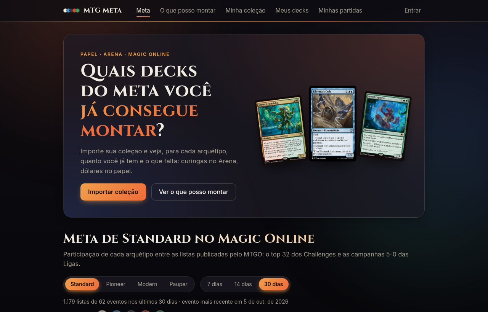
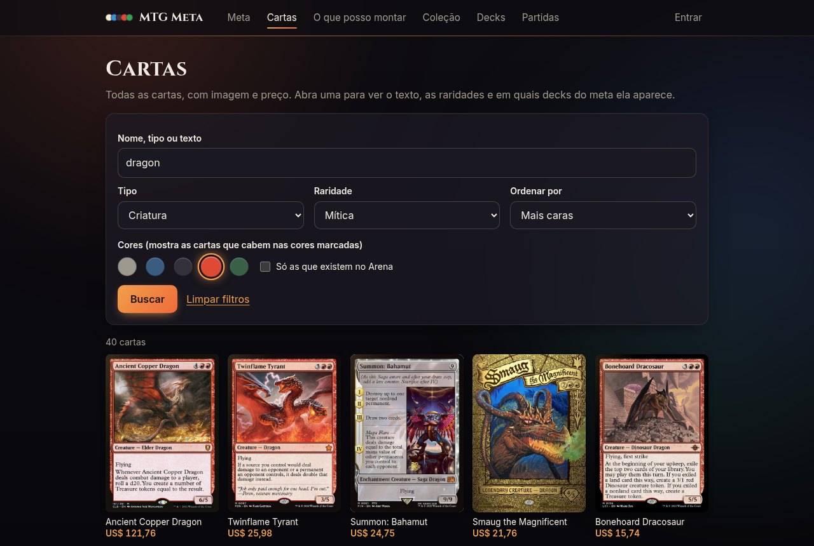
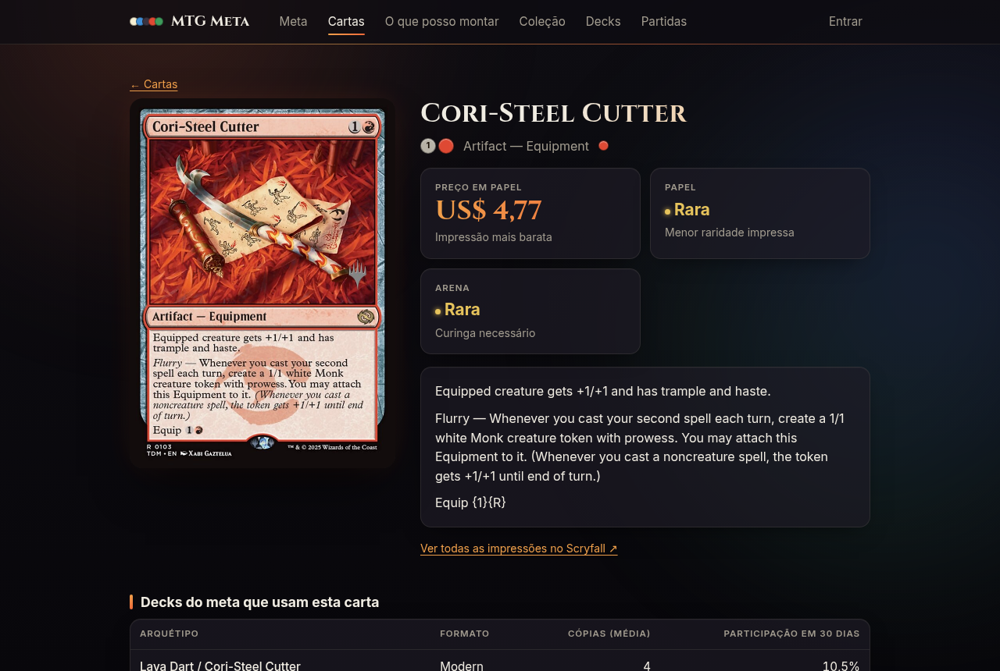
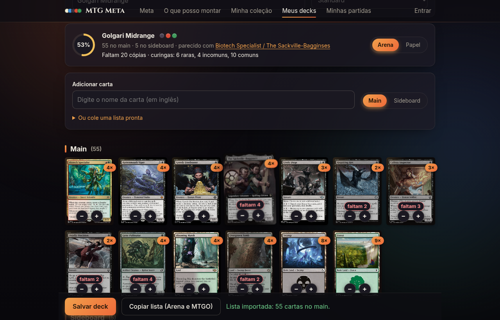
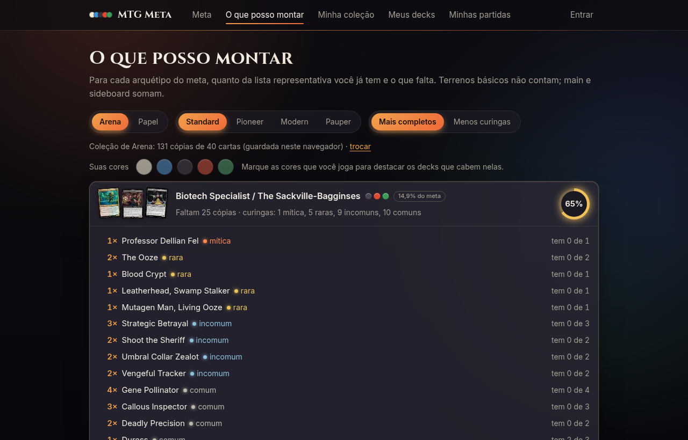
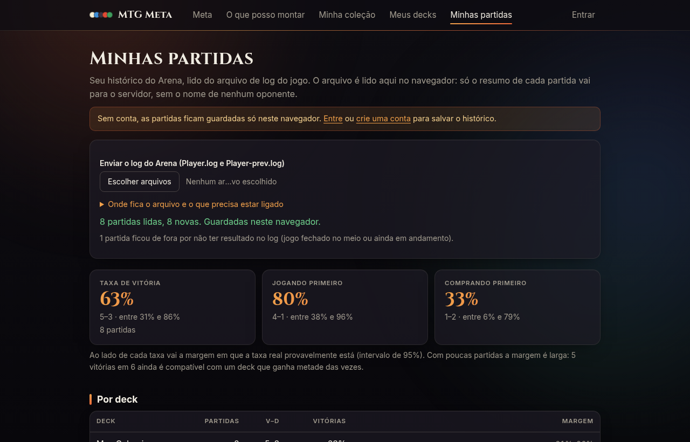

<div align="center">

# 🃏 MTG Meta

**O meta do Magic por formato, e quais decks dele você já consegue montar.**

Cruza a sua coleção (papel ou Arena) com os arquétipos dos torneios do Magic Online<br>
e acompanha as suas partidas do Arena. Gratuito, sem cadastro obrigatório.




</div>

## ✨ O que tem

| | |
|---|---|
| 📊 **Meta** | Participação de cada arquétipo em Standard, Pioneer, Modern e Pauper, em janelas de 7, 14 e 30 dias. Página por arquétipo com lista representativa, cartas-chave e resultados recentes. |
| 🔎 **Cartas** | Todas as cartas com imagem e preço. Filtre por nome, texto, cor, tipo e raridade; cada carta tem página própria com custo, texto, raridades em papel e no Arena e os decks do meta que a usam. |
| ⭐ **Decks que eu quero** | Marque arquétipos do meta como objetivo e acompanhe só eles em "O que posso montar". |
| 🧩 **O que posso montar** | Quanto da lista de cada arquétipo você já tem e o que falta: curingas por raridade no Arena, dólares no papel. |
| 🛠️ **Meus decks** | Crie e salve seus decks buscando cartas ou colando uma lista. Mostra as cartas em imagem, as cores, o arquétipo parecido no meta e quanto da sua coleção já cobre. Inclui os 15 decks iniciais do Arena, prontos para abrir e copiar. |
| 🎨 **Suas cores** | Marque as cores que você joga e o site destaca (ou mostra só) os arquétipos que cabem nelas, no meta e em "O que posso montar". |
| 🖼️ **Imagens das cartas** | Decklists em imagem, miniaturas nos arquétipos e a carta ao lado do nome ao passar o mouse. |
| 📚 **Minha coleção** | Importa CSV (Moxfield, Manabox, Archidekt, TCGplayer…) ou lista `4 Nome da Carta`. Papel e Arena separados. |
| ⚔️ **Minhas partidas** | Histórico do Arena lido do `Player.log`: taxa de vitória por deck, por fila, jogando ou comprando primeiro e contra cada arquétipo. |
| 📡 **Tracker** | Programa que acompanha o jogo e envia cada partida assim que ela termina. |
| 👤 **Conta opcional** | Tudo funciona sem conta, com os dados no navegador. A conta só serve para salvar; dá para baixar os dados e apagar tudo. |

<table>
<tr>
<td width="50%"></td>
<td width="50%"></td>
</tr>
<tr>
<td colspan="2"></td>
</tr>
<tr>
<td width="50%"></td>
<td width="50%"></td>
</tr>
</table>

## 🚀 Rodar com um clique (Docker)

Só precisa do [Docker Desktop](https://www.docker.com/products/docker-desktop/) instalado e aberto (no Linux, o Docker Engine com o plugin Compose). Não precisa de Node.

| Sistema | Subir o site | Parar | Tracker do Arena |
|---|---|---|---|
| 🪟 Windows | dois cliques em `iniciar.bat` | `parar.bat` | `tracker.bat` |
| 🍎 macOS | dois cliques em `iniciar.command` | `parar.command` | `tracker.command` |
| 🐧 Linux | `./iniciar.sh` | `./parar.sh` | `./tracker.sh` |

O atalho monta a imagem, baixa as cartas e um mês de torneios, espera o site responder e abre o navegador em `http://localhost:3000`. A primeira vez leva alguns minutos; as seguintes, segundos. Sem os atalhos, o equivalente é `docker compose up -d --build`.

- 📱 **Celular, tablet ou outro computador** não rodam o Docker, mas usam o site pelo navegador: na mesma rede, abra `http://IP-do-computador:3000`.
- 💾 **Os dados** (contas, coleções, partidas, torneios) ficam em um volume do Docker e sobrevivem a parar e atualizar. `docker compose down -v` apaga tudo.
- 🔄 **Atualiza sozinho**: torneios a cada 8 h, cartas uma vez por dia.
- 🎮 **O tracker** roda no computador onde o Arena está instalado, porque lê o log do jogo. O atalho acha a pasta do log, pede a chave uma vez (site → Conta → Gerar chave) e guarda os dois no arquivo `.env`.
- 🔌 **Outra porta**: crie um arquivo `.env` com `PORTA=8080` (veja [.env.example](.env.example)).
- 🐧 **No Linux**, se o atalho disser que o Docker não respondeu, seu usuário não está no grupo `docker`: `sudo usermod -aG docker $USER` e entre de novo na sessão.

> [!WARNING]
> A imagem do Docker e os atalhos `.bat` e `.command` ainda não foram executados de verdade. O que foi testado é o roteiro de inicialização do contêiner ([docker/iniciar.mjs](docker/iniciar.mjs)) rodando fora dele, e a sintaxe do `docker-compose.yml` e dos scripts de shell.

## 🛠️ Rodar sem Docker (desenvolvimento)

Precisa de Node 20 ou mais novo.

```bash
npm install
npm run cartas:baixar    # banco de cartas do Scryfall (~80 MB de download, gera data/cards.json)
npm run meta:ingerir     # torneios do MTGO dos últimos 30 dias (1 a 2 minutos na primeira vez)
npm run dev              # site em http://localhost:3000
```

Rode `cartas:baixar` no máximo uma vez por dia (o Scryfall atualiza preços 1x por dia e pede cache de 24 h). Rode `meta:ingerir` quantas vezes quiser: só baixa torneios novos ou alterados; a fonte atualiza a cada ~8 h.

| Comando | O que faz |
|---|---|
| `npm run dev` / `build` / `start` | Site em desenvolvimento / build de produção / servir o build |
| `npm test` | Testes (95) |
| `npm run typecheck` | Checagem de tipos de todos os pacotes |
| `npm run cartas:baixar` | Baixa o bulk do Scryfall e gera `data/cards.json` |
| `npm run meta:ingerir -- --dias 7 --formatos standard,modern` | Ingestão com janela e formatos escolhidos |
| `npm run tracker -- --servidor http://localhost:3000 --chave mtgm_...` | Acompanha o Arena e envia cada partida ao terminar (depois da primeira vez, só `npm run tracker`) |
| `npm run arquetipo:renomear -- 153 "Golgari Midrange"` | Troca o nome provisório de um arquétipo |
| `npm run cobertura -- --colecao x.csv --decks pasta/ --plataforma papel` | Motor de cobertura na linha de comando |
| `npm run exemplo` | O mesmo, com os dados de exemplo |

<details>
<summary><b>O banco local aceita um processo por vez</b></summary>

<br>

O banco é um Postgres embutido ([PGlite](https://pglite.dev)) gravado em `data/pglite/`. Ele não aceita dois processos ao mesmo tempo, então com o site no ar:

- a ingestão roda por dentro do site: `CRON_SECRET=... npm run meta:ingerir -- --servidor http://localhost:3000` (o site precisa ter sido iniciado com o mesmo `CRON_SECRET`; veja [.env.example](.env.example));
- `arquetipo:renomear` e a ingestão direta pedem para parar o site antes, com uma mensagem clara.

Para recomeçar do zero, pare o site e apague `data/pglite/`.

</details>

## 📡 Tracker em tempo real

Em vez de enviar o arquivo de log depois de jogar, deixe o tracker aberto: ele confere o `Player.log` a cada 3 segundos e envia cada partida assim que ela termina. A página Minhas partidas se atualiza sozinha.

1. Entre no site, abra **Conta** e clique em **Gerar chave**. A chave aparece uma vez só, já dentro do comando pronto para copiar.
2. Rode o comando copiado (`npm run tracker -- --servidor ... --chave ...`), ou use o atalho `tracker.*` do Docker. O endereço e a chave ficam guardados; nas próximas vezes basta `npm run tracker`.
3. Jogue. Cada partida terminada aparece no terminal e no site.

- 🔑 A chave só serve para enviar partidas. Gerar outra invalida a anterior, e dá para revogar na página Conta.
- ⏮️ Ao abrir, o tracker envia também o que já está no `Player.log` e no `Player-prev.log`, sem repetir o que já foi enviado.
- 📶 Se o site estiver fora do ar, ele guarda a partida e tenta outra vez.
- 📂 A pasta do log é encontrada sozinha no Windows, no macOS e no Linux com Steam; fora do lugar padrão, use `--log pasta`. `--uma-vez` envia o que há e sai.

No Arena, a opção **Options → Account → Detailed Logs (Plugin Support)** precisa estar ligada; sem ela o jogo não registra as partidas.

## 🧠 Como funciona

<details>
<summary><b>Como os arquétipos são definidos</b></summary>

<br>

A fonte não traz o nome do arquétipo de cada lista, então o classificador agrupa por semelhança:

1. De cada deck entram só as cartas não-terreno do main.
2. A semelhança entre dois decks é a Jaccard ponderada (cópias em comum ÷ cópias no total). Um deck entra no arquétipo mais parecido se passar de 0,4.
3. Os que não entram em nenhum são agrupados entre si; grupos com 3 ou mais listas viram arquétipos novos. O resto aparece como "Outros".
4. O nome inicial são as duas cartas que mais distinguem o grupo dos outros do formato (ex.: "Amulet of Vigor / Spelunking"). É provisório: use `arquetipo:renomear` para dar o nome que a comunidade usa. O número do arquétipo, e portanto o endereço da página, não muda.

</details>

<details>
<summary><b>Como a cobertura é calculada</b></summary>

<br>

- Main e sideboard somam, porque o limite de 4 cópias vale para os dois juntos.
- Terrenos básicos comuns não contam; básicos snow contam.
- **Arena**: curinga pela menor raridade em que a carta existe lá. Listas com cartas fora do Arena ficam marcadas e vão para o fim.
- **Papel**: preço em dólar da impressão mais barata no Scryfall. Cartas sem preço aparecem marcadas e ficam fora da soma.

</details>

<details>
<summary><b>Como o log do Arena é lido</b></summary>

<br>

A ideia vem do [Tapps Tracker](https://github.com/pattont/MTGA-Tapps) (rastreador local do Arena, licença AGPL-3.0): ler o `Player.log` e transformar em histórico e estatísticas. Aqui só a ideia foi aproveitada; o leitor ([packages/core/src/arena-log.ts](packages/core/src/arena-log.ts)) foi escrito do zero e nenhum código de lá foi copiado.

Do log saem: fila, resultado da partida e de cada jogo, quem começou, o deck enviado e as cartas do oponente que ficaram visíveis. O arquivo é lido no navegador; para o servidor vai só o resumo de cada partida, sem nome de oponente. As cartas vêm como números do Arena, e `data/cards.json` guarda esses números (`arenaIds`) para trocá-los por nomes.

O arquétipo do oponente é um palpite: a fração das cartas vistas que batem com cada arquétipo do meta do MTGO, só para Standard e Pioneer e com pelo menos 3 cartas não-terreno vistas.

</details>

## 🗂️ Estrutura

```
packages/core   núcleo sem dependências: parsers, cobertura, classificador, leitor do log do Arena
packages/db     esquema (migrações), conexão e consultas
jobs/           ingestão do MTGO, classificação e agregação do meta
apps/web        site (Next.js): páginas e API
apps/tracker    programa que acompanha o Player.log e envia as partidas
docker/         roteiro de inicialização do contêiner
data/           banco local e cards.json (não versionados)
```

Monorepo com npm workspaces. Os pacotes são TypeScript puro, sem etapa de build: os comandos rodam com `tsx` e o Next transpila direto do código-fonte, por isso os imports internos usam a extensão `.ts`. O desenho completo e as fases estão em [ARQUITETURA.md](ARQUITETURA.md).

## ⚠️ Limitações conhecidas

- **O leitor do log do Arena ainda não foi testado com um `Player.log` real**, só com logs montados no formato conhecido. O formato não é documentado pela Wizards e muda sem aviso.
- Os nomes dos arquétipos são automáticos até alguém renomear.
- A participação mede presença entre os melhores resultados, não taxa de vitória: o MTGO só publica o top 32 dos Challenges e as campanhas 5-0 das Ligas.
- O login não tem limite de tentativas nem recuperação de senha por e-mail; precisa dos dois antes de ir para a internet aberta.
- O tracker roda em uma janela de terminal (ou no Docker). Ainda não é um aplicativo instalável com ícone na bandeja, nem tem painel sobre a tela do jogo.
- O banco hospedado (Supabase ou Neon) ainda não está ligado: falta uma implementação da interface `Db` em [packages/db/src/client.ts](packages/db/src/client.ts). O SQL já é Postgres puro.
- O texto das cartas está em inglês, como vem do Scryfall, e a busca é por termos em inglês.
- As cores preferidas e os decks marcados como objetivo ficam guardados no navegador, não na conta: em outro aparelho é preciso marcar de novo.
- O editor de decks não tem uma área separada para comandante; ele entra no main.
- Preços em dólar do Scryfall, com até 24 h de atraso; não há preço em reais.
- Cartas rebalanceadas do Alchemy (`A-Nome`) são tratadas como cartas separadas da original.

## 🙏 Fontes e créditos

- Cartas, preços e imagens: [Scryfall](https://scryfall.com/docs/api/bulk-data). Não pode haver paywall sobre esses dados, e as imagens aparecem sempre com a carta inteira (sem recortar o nome do artista nem o copyright), como as regras deles pedem.
- Torneios: [mtgo.com](https://www.mtgo.com/decklists), via [modometa/modometa-mtgo-data](https://github.com/modometa/modometa-mtgo-data) (licença MIT).
- Decks iniciais do Arena: listas de [Draftsim](https://draftsim.com/mtg-arena-starter-decks/), lidas em outubro de 2026. A Wizards só publicou a versão de 2024 desses decks; se o Arena trocá-los, a lista em [packages/core/src/starter-decks.ts](packages/core/src/starter-decks.ts) precisa ser atualizada à mão.
- Ideia do acompanhamento de partidas: [Tapps Tracker](https://github.com/pattont/MTGA-Tapps).

## 📄 Licença

Código sob a licença [MIT](LICENSE). Os dados de cartas, preços e torneios pertencem às suas fontes e seguem as regras delas.

---

<sub>MTG Meta is unofficial Fan Content permitted under the Fan Content Policy. Not approved/endorsed by Wizards. Portions of the materials used are property of Wizards of the Coast. ©Wizards of the Coast LLC.</sub>
